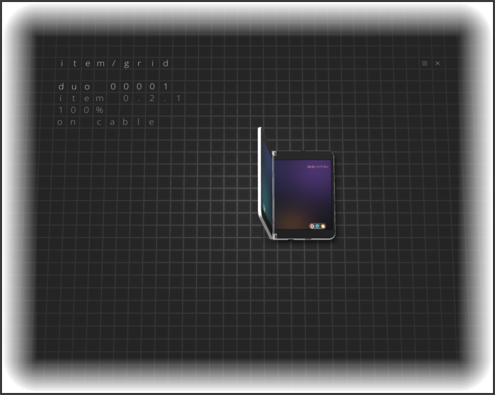
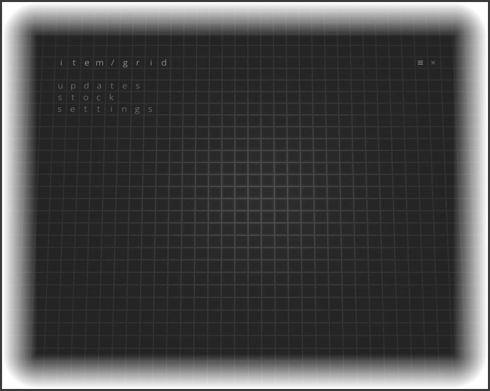
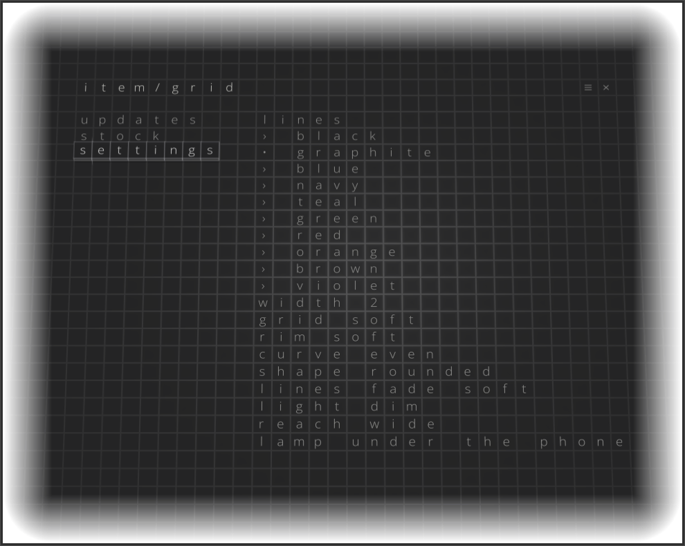

# item/grid

**item/grid** looks after a connected Surface Duo from a Linux computer, in
the spirit of a desktop's page for a connected phone: it sees what the phone
is doing, installs and updates [item](https://github.com/agentsco-lab/item)
and the port, reads the phone's logs, takes screenshots, backs the phone up
and - by the safety rules learned on this device, as code - RAM-boots and
writes images to it, installs the whole system from a release image, and
takes the phone back to stock Android and to Linux again. The command is
`itemgrid`; the window is item/grid.

**Until 1.0, item/grid is an experiment**, as item is. It writes to the
phone's partitions, so the rules below are checks in its core that cannot be
gone around, not notes to remember - but it has been used on one phone, the
owner's, from one Linux computer. Keep your own backups of `boot_a`, `boot_b` and `misc` from TWRP
before you let it write anything.

## What it does

`itemgrid --help` is the list; the main ones:

| | |
|---|---|
| `status` | what the phone is doing; on Linux the versions of item and the port, the battery, heat, free space, uptime, failed services |
| `update` | build item, install it, reboot, wait until it runs (`--no-build`: install what is built) |
| `logs` | the phone's journal: a boot, a unit, a pattern, since a time; saved to a file for a ticket |
| `run`, `shell` | a command (sent as a script) or a shell on the phone, as root or as its owner; the dangerous ones refused |
| `screenshot` | both panels as one PNG, through item's live mirror of the screen |
| `backup` | device data (once), the boot chain, home and settings; `full`: the whole system from TWRP |
| `slots`, `confirm`, `ramboot` | the two boot slots and their state; a boot image tried from RAM first, by the rules |
| `install` | erase and install item from a release image (`--keep-files` keeps home, Wi-Fi, the time zone, the PIN) |
| `stock`, `android` | Microsoft's packages and their boot chain; the way to stock Android and back |
| `club`, `register` | the Duo owners' club: a token, the phone's number |

**The window** shows the Duo drawn as it is held - the hinge and the
gravity from the phone's sensors, its screen live from item's mirror - on a
table of light, and a few lines on how it is: the phone's number in the
club, item's version, the battery, the link. The menu is three lines drawn
on the same table: *updates* (item's version and build; the update),
*stock* (the way back to the phone's Android), *settings* (the table's
look: the lines' colour and width, the grid, the light, the lamp under the
phone); Developer Mode adds a fourth with the slots, images from RAM, every
kind of backup and the logs. What is not on the table yet is the command
line's.

| | |
|---|---|
|  |  |
| The window: the Duo as it is held, its lock screen live from item's mirror; beside it the club's number, item's version, the battery, the cable. | The menu, drawn on the table as the rest. |
|  | |
| Settings: the table's look - the lines' colour, the grid, the rim, the light, the lamp. | |

`itemgrid status`, the same phone:

```
Phone:     Linux (172.16.42.1)
Club:      00001
System:    Droidian 102 (2026-08-30), kernel 4.14-190-perf-microsoft-surfaceduo, up 8 h 18 min
item:      0.2.1 (built 2026-10-09 06:18), running
Port:      0.22.0, sensorfw 0.14.8+itemae3
Fingers:   1 enrolled
Battery:   100%, discharging, 26 °C
CPU:       32 °C
Disk /         79.4 GB free of 89.3 GB
Disk /userdata 9.9 GB free of 101.9 GB
```

## The safety rules, as code

Learned on the device; each is a check in `crates/core`, not a thing to
remember.

- **Writing to the phone:** RAM boot first and always; one change per boot;
  a backup before any write; never in one click. An image is written to a
  slot only once it booted Linux from RAM on that phone.
- **Never read `/sys/kernel/debug/gpio` on the Duo:** it resets the phone at
  once. Such commands are refused, as is writing block devices through `run`.
- **Updates go through a reboot:** restarting the vendor hwcomposer resets
  the phone about one time in three.
- **Commands are sent as a script file.** A `pkill -f` pattern sent inline
  over ssh matches its own shell and kills it.
- **The owner's settings, keys and system are left as they were.**

## How it is built

Rust, GTK4 and libadwaita.

| | |
|---|---|
| `crates/core` | `itemgrid-core`: what the phone is doing, every action and every safety rule; the command line and the window only show what is here |
| `crates/cli` | `itemgrid`, the command line over the core |
| `crates/gui` | `itemgrid-gui`, the window: the table, the phone drawn as it is held, the night and day |
| `crates/motion` | `duo-motion`, run on the phone over ssh while the window follows it: the hinge, the lid and the gravity from sensorfw |
| `crates/mcp` | `itemgrid-mcp`, an MCP server that lets Claude Code look at the window and try it with a real pointer, on a screen of its own |
| `tools/` | `package-deb.sh`, `install-local.sh`, `fetch-fonts.sh` |
| `docs/` | [REGISTRY.md](docs/REGISTRY.md), the club's server side |

The phone is reached over ssh on the USB link (172.16.42.1), or over Wi-Fi
once the cable has shown its key; fastboot and TWRP (adb) for the modes
where Linux is not running.

```
cargo build --release
install -Dm755 target/release/itemgrid     ~/.local/bin/itemgrid
install -Dm755 target/release/itemgrid-gui ~/.local/bin/itemgrid-gui
```

## License

MIT, see [LICENSE](LICENSE).
